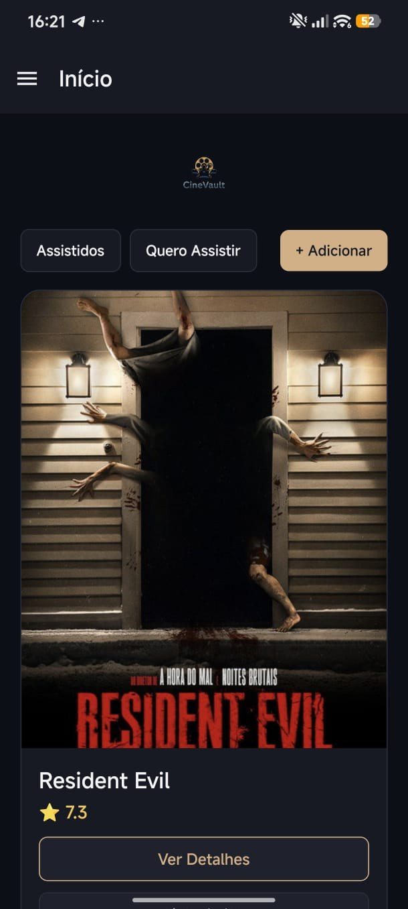
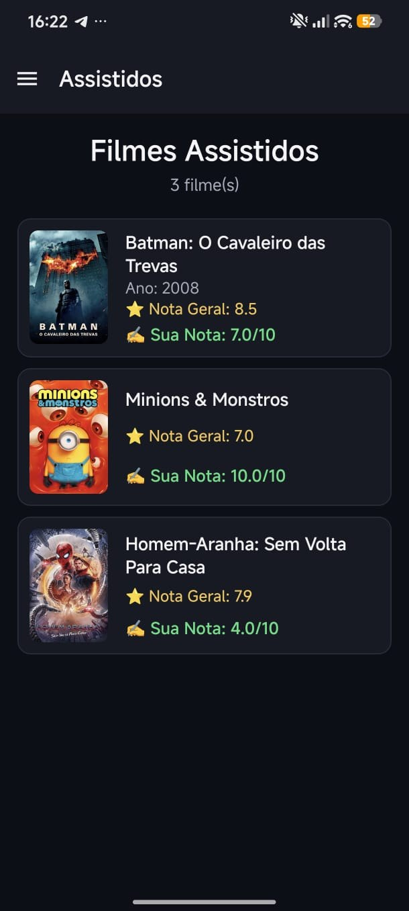
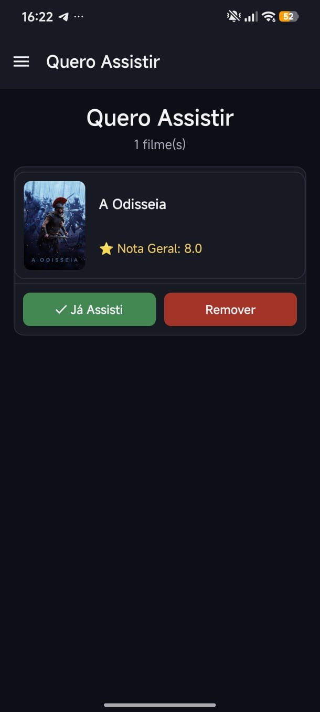

# 🎬 CineVault

Aplicativo mobile para descobrir filmes, montar suas listas de **Assistidos** e **Quero Assistir**, e registrar suas próprias avaliações — com uma interface escura e cinematográfica inspirada em plataformas como Letterboxd e IMDb.

Desenvolvido com **React Native + Expo Router + TypeScript**, integrado à API pública do **TMDB (The Movie Database)**.

---

## 📱 Teste o aplicativo

<p align="center">
  <a href="https://github.com/Alceu-2004/CineVault/releases/latest/download/CineVault.apk">
    
  </a>
</p>

O APK pode ser instalado diretamente em dispositivos Android. Ao instalar, o Android pode pedir permissão para instalar apps de fontes desconhecidas, o que é normal para APKs fora da Play Store.

> **Recomendação:** o aplicativo utiliza a API do TMDB para carregar filmes. Para testar a versão disponibilizada, o APK já possui a configuração necessária para acesso à API.

---

## 🖼️ Telas

<table>
  <tr>
    <td width="33%" align="center">
      
      <br/>
      <sub><b>Início</b><br/>Filmes populares, busca e atalhos para as listas.</sub>
    </td>
    <td width="33%" align="center">
      
      <br/>
      <sub><b>Assistidos</b><br/>Sua nota ao lado da nota geral do TMDB.</sub>
    </td>
    <td width="33%" align="center">
      
      <br/>
      <sub><b>Quero Assistir</b><br/>Marque como assistido ou remova da lista.</sub>
    </td>
  </tr>
</table>

---

## ✨ Destaques

* 🔐 Sistema de cadastro e login com múltiplas contas no mesmo dispositivo
* 🎬 Catálogo de filmes populares
* 🔎 Busca de filmes em tempo real utilizando a API do TMDB
* ⭐ Avaliação pessoal dos filmes com notas de 0 a 10
* 👀 Organização entre filmes **Assistidos** e **Quero Assistir**
* 📋 Listas independentes para cada conta cadastrada no dispositivo
* 📖 Tela de detalhes com sinopse, informações e avaliação
* 🧭 Navegação por menu lateral (Drawer)
* 🌙 Interface com tema escuro e identidade visual cinematográfica
* 💾 Persistência local dos dados utilizando AsyncStorage

---

## 🛠️ Stack técnica

| Camada             | Tecnologia                                               |
| ------------------ | -------------------------------------------------------- |
| Framework          | React Native + Expo (SDK 54)                             |
| Navegação          | Expo Router                                              |
| Linguagem          | TypeScript                                               |
| Estado global      | Context API                                              |
| Persistência local | AsyncStorage                                             |
| API externa        | [TMDB API](https://www.themoviedb.org/documentation/api) |
| HTTP Client        | Axios                                                    |
| Build              | EAS Build                                                |
| Distribuição       | Android APK                                              |

---

## 📂 Estrutura do projeto

```text
app/
├── (auth)/                  # Telas de autenticação
│   ├── login.tsx
│   ├── register.tsx
│   └── _layout.tsx
├── (drawer)/                # Telas principais
│   ├── home.tsx             # Filmes populares + busca
│   ├── assistidos.tsx       # Filmes assistidos
│   ├── quero-assistir.tsx   # Lista de filmes desejados
│   ├── about.tsx            # Informações sobre o aplicativo
│   └── _layout.tsx
├── movie/[id].tsx           # Detalhes de um filme
└── _layout.tsx              # Layout raiz e autenticação

src/
├── api/
│   └── imdbApi.ts           # Cliente da API do TMDB
├── components/
│   ├── MovieCard.tsx
│   └── RatingPromptModal.tsx
├── contexts/
│   ├── AuthContext.tsx      # Autenticação e gerenciamento de contas
│   └── MoviesContext.tsx    # Listas de filmes por usuário
├── theme/
│   └── colors.ts            # Paleta visual centralizada
└── types/
    └── movie.ts             # Tipagens relacionadas aos filmes
```

---

## 🚀 Rodando o projeto localmente

### Pré-requisitos

* [Node.js](https://nodejs.org/) instalado
* [Expo Go](https://expo.dev/go) instalado no celular
* Uma chave de API gratuita do TMDB

### 1. Clone o repositório

```bash
git clone https://github.com/Alceu-2004/CineVault.git
cd CineVault
```

### 2. Instale as dependências

```bash
npm install
```

### 3. Configure a chave da API do TMDB

O CineVault utiliza a API do TMDB para buscar informações sobre filmes.

A chave da API **não é armazenada no repositório**. Cada ambiente de desenvolvimento deve utilizar sua própria chave.

1. Crie uma conta no [TMDB](https://www.themoviedb.org/).
2. Acesse **Configurações → API**.
3. Gere uma chave utilizando **API Key v3 auth**.
4. Na raiz do projeto, crie um arquivo chamado `.env`.

Adicione:

```env
EXPO_PUBLIC_TMDB_API_KEY=sua_chave_aqui
```

O arquivo `.env.example` pode ser utilizado como referência.

### 4. Inicie o servidor de desenvolvimento

```bash
npx expo start
```

Escaneie o QR Code utilizando o **Expo Go** no Android ou iOS.

---

## 📦 Build para Android

O projeto utiliza **EAS Build** para gerar os aplicativos Android.

O perfil `production` está configurado para gerar um arquivo `.apk` instalável diretamente em dispositivos Android.

```bash
eas build --platform android --profile production
```

### Variável de ambiente no EAS

Para builds realizados através do EAS, a chave do TMDB deve estar configurada no ambiente `production`:

```bash
eas env:create --name EXPO_PUBLIC_TMDB_API_KEY --value sua_chave --environment production --visibility plaintext
```

Para verificar as variáveis configuradas:

```bash
eas env:list --environment production
```

---

## 🎨 Design

O CineVault utiliza uma identidade visual baseada em uma paleta escura e cinematográfica.

As cores principais são centralizadas em:

```text
src/theme/colors.ts
```

Isso permite ajustar a identidade visual do aplicativo de forma centralizada.

---

## 📱 Distribuição

A versão Android do CineVault está disponível para download através das **GitHub Releases**.

**[⬇️ Baixar a versão mais recente do CineVault](https://github.com/Alceu-2004/CineVault/releases/latest)**

Para desenvolvedores interessados no código-fonte:

**[💻 Ver repositório no GitHub](https://github.com/Alceu-2004/CineVault)**

---

## 👨‍💻 Desenvolvimento

O CineVault foi originalmente desenvolvido como um projeto acadêmico colaborativo e posteriormente retomado e evoluído para fins de estudo, portfólio e aprimoramento técnico.

O projeto representa uma oportunidade prática de trabalhar com:

* Desenvolvimento mobile
* React Native
* TypeScript
* Arquitetura baseada em componentes
* Gerenciamento de estado com Context API
* Persistência local
* Integração com APIs externas
* Variáveis de ambiente
* Build e distribuição Android com EAS

---

## 📝 Licença

Projeto desenvolvido para fins de **portfólio, aprendizado e demonstração técnica**.
